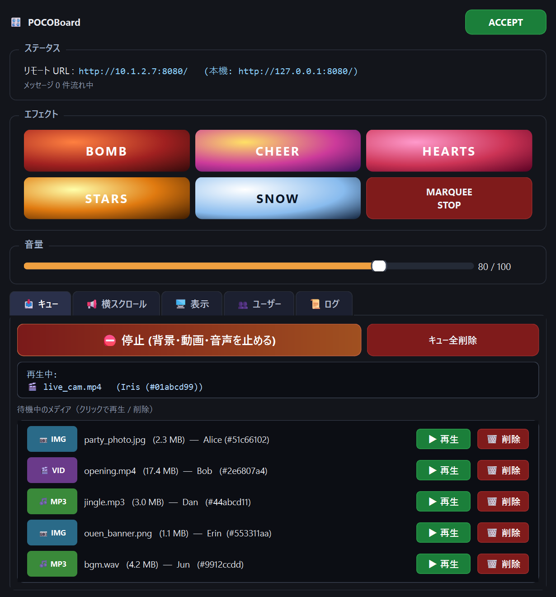
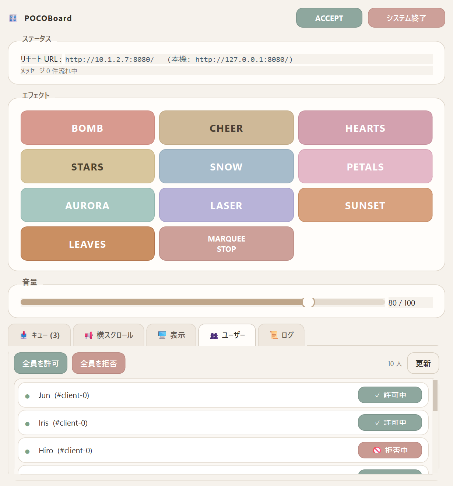
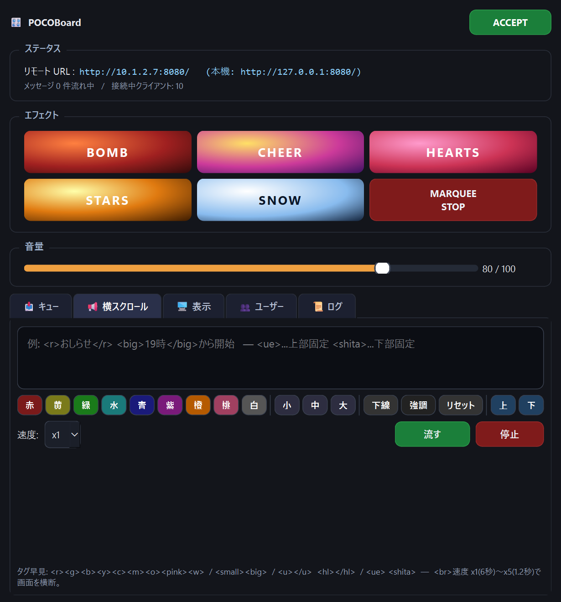
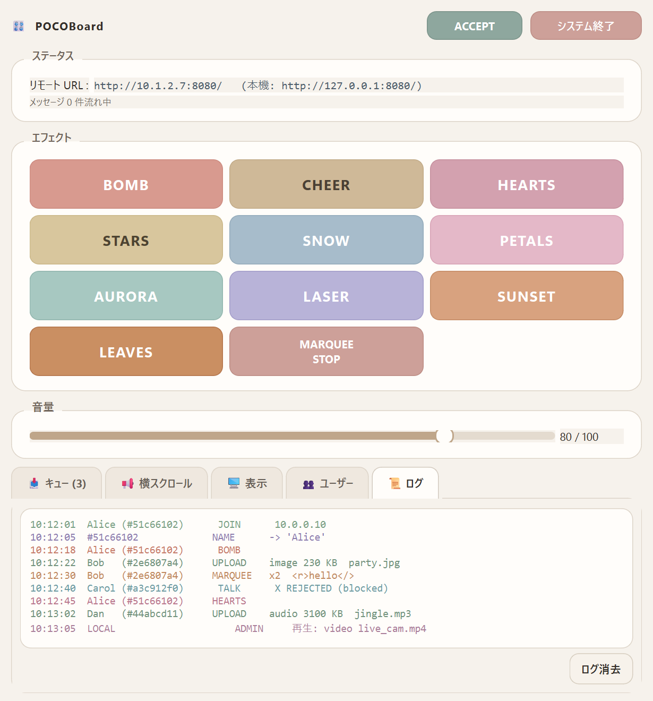

# POCOBoard


配信中の「画面演出サイドキック」として動く **Windows ネイティブ** のデスクトップアプリです。

[M5Tab-Poco](https://github.com/OwaHigashi/M5Tab-Poco) の Windows 版移植

操作ウィンドウと表示ウィンドウを**別モニタ**に配置するマルチスクリーン構成で、同じ LAN 内にいる視聴者のブラウザから複数人が同時に BOMB / CHEER / HEARTS / STARS / SNOW といった演出を投げ込んだり、画像・動画・MP3 を投稿したり、マイクで喋りかけたりできます。

PySide6 / Qt 6 製。PyInstaller で 1 フォルダに固めれば、配布先 PC に Python を入れなくても exe をダブルクリックで起動します。

---

## 🎛 主な機能

- **2 画面運用** — 操作ウィンドウ（固定サイズ）と表示ウィンドウ（全画面/最大化）を別モニタへ自動配置
- **ブラウザ経由のリモート操作** — 同一 LAN のスマホ/PC の任意ブラウザから複数人が同時接続
- **5 種の GPU 加速パーティクル演出** — BOMB / CHEER / HEARTS / STARS / SNOW（60 fps、解像度非依存）
- **ニコニコ風横スクロール** — 上限なし、重なり許可、`<ue>` / `<shita>` で上下固定も可
- **メディア投稿** — 画像 / 動画 / MP3 をアップロード → 制御側のキューで順次承認再生
- **背景として保持** — 画像・動画・音声は「⛔ 停止」ボタンを押すまで出し続ける（動画・音声は無限ループ）
- **TALK（マルチ発話ミキサー）** — ブラウザのマイクを PC スピーカへ。**同時発話はサンプル単位で加算ミックス**
- **ユーザー識別＋ブロック** — Cookie で各ブラウザを一意 ID 化、個別 / 一括で許可・拒否
- **リクエストログ** — 「誰が・何を」色分けで流れる表示
- **動画 / 音声対応形式** — `.mp4 / .mkv / .mov / .avi / .webm / .m4v / .wmv / .mp3 / .wav / .m4a / .aac / .ogg / .flac`

---

## 📸 スクリーンショット

| キュー（主操作） | ユーザー管理 |
|---|---|
|  |  |

| 横スクロール作成 | リクエストログ |
|---|---|
|  |  |

---

## 🖥 動作要件

- Windows 10 / 11 (64-bit)
- ディスプレイ 1 枚でも動きます（2 枚以上推奨）
- スピーカー（内蔵でも外付けでも可）
- Wi-Fi または有線 LAN — 配信 PC とスマホ / 他 PC が同じネットワークにいること
- 視聴者ブラウザ: Edge / Chrome / Firefox / Safari 16+

**exe 版** を使うだけなら Python のインストールは **不要** です。

---

## ⚡ インストール

### A. exe 版（一番かんたん・配布推奨）

1. リリース ZIP を展開 — 例: `C:\POCOBoard\`
2. `POCOBoard.exe` をダブルクリック
3. 初回に SmartScreen が出たら「詳細情報」→「実行」
4. （任意）同じフォルダに `config.example.ini` を `config.ini` としてコピー、お好みで編集

```
POCOBoard\
  POCOBoard.exe        ← これをダブルクリック
  config.example.ini   ← 必要ならコピーして config.ini に
  _internal\           ← Qt DLL など（触らないでOK）
```

### B. ソース版（改造・開発用）

```bat
git clone git@github.com:OwaHigashi/POCOBoard.git
cd POCOBoard
install-deps.bat     :: PySide6 などを pip で導入
run.bat              :: 起動
```

必要: [Python 3.10+](https://www.python.org/downloads/)（インストーラで **Add python.exe to PATH** にチェック）

---

## 🚀 初回起動

`POCOBoard.exe` を実行すると **2 つのウィンドウ** が開きます。

| ウィンドウ | 役割 | サイズ |
|---|---|---|
| **Control** | オペレータ（配信者）が使う固定サイズのパネル | 820 × 880 |
| **Display** | 視聴者に見せる大画面（FX / 横スクロール / 背景） | 全画面 or 最大化可 |

モニタが 2 枚あると Display は **Control の反対側** に自動配置されます。

起動したら、操作ウィンドウ上部に出ている **リモート URL**（例 `http://192.168.1.23:8080/`）を、スマホ / 他 PC のブラウザで開いてください。

---

## 🎮 使い方

### 制御ウィンドウ（オペレータ）

常時表示のヘッダ + 下部タブ構造:

**ヘッダ（常時表示）**
- タイトル + `ACCEPT / REJECT` トグル — 受付全体のスイッチ
- ステータス — リモート URL、メッセージ流数、接続中クライアント数
- **エフェクト 6 ボタン** — BOMB / CHEER / HEARTS / STARS / SNOW / MARQUEE STOP
- **音量スライダ** — 0〜100（FX / TALK / BGM 共通）

**タブ**
- 📥 **キュー** — アップロード待機リスト＋「⛔ 停止」
- 📢 **横スクロール** — メッセージ作成・タグボタン・速度選択・流す / 停止
- 🖥 **表示** — 出力スクリーン選択・F11 フル化・ローカルファイル再生
- 👥 **ユーザー** — 接続中クライアント一覧＋個別許可/拒否＋一括許可/拒否
- 📜 **ログ** — 「誰が何をしたか」色分けリクエストログ

### ブラウザ（リモート側）

URL を開くと次のUIが出ます:

- 左上の **表示名入力欄** — ログに表示されます（Cookie に保存、次回も復元）
- **BOMB / CHEER / TALK / HEARTS / STARS / SNOW** の 6 ボタン
- **📷 写真 / 🎬 動画 / 🎵 音声** アップロード（各 25/200/50 MB まで）
- **📢 横スクロール** コンポーザ（タグボタン・速度 x1〜x5）
- 右上の **受付:ON/OFF** / **音量** 現在値

> **TALK について**: ブラウザの仕様上 **HTTPS または `localhost` 経由**でないとマイクが開けません。LAN 上で `http://` のままだと、一部ブラウザでマイク許可が降りません。

### 表示ウィンドウのレイヤ構造

Display は下から順に 4 層で描画されます:


|4) 横スクロール（最前面・常に読める）|
|:--|
|3) FX (BOMB / CHEER / 等 — 一時エフェクト) |
|2) 背景: 画像 or 動画（停止まで残る／動画は無限ループ）|
|1) ベース: 黒 or タイトル画面|

- **タイトル画面** — 起動直後と **5 分間リクエストが無い** ときに表示
- **背景** — 画像 / 動画（ループ）/ 音声（ループ）は **「⛔ 停止」を押すまで残る**
- **FX** — 数秒で終わる。背景の上に重ねて表示（動画背景上では 75 % 透過）
- **横スクロール** — 常に最前面、FX 中でも読める

### キュー管理（📥 キュータブ）

**ブラウザから送られたメディアは自動再生されず、キューに積まれる** だけです。オペレータが順に捌きます。

```
┌─ 📥 キュー ─────────────────────────────────────┐
│ [⛔ 停止 (背景・動画・音声を止める)]  [キュー全削除] │
│ ┌───────────────────────────────────────────┐ │
│ │ 再生中: 🎬 live_cam.mp4  (Iris (#01abcd99))│ │
│ └───────────────────────────────────────────┘ │
│                                                 │
│ 📷 IMG  party_photo.jpg (2.3MB)  Alice [▶再生][🗑] │
│ 🎬 VID  opening.mp4 (17.4MB)     Bob   [▶再生][🗑] │
│ 🎵 MP3  jingle.mp3 (3.0MB)       Dan   [▶再生][🗑] │
│ …                                               │
```

- **`[▶ 再生]`** — そのアイテムを今すぐ表示/再生し、キューから外す
- **`[🗑 削除]`** — 再生せずに破棄（ファイルも削除）
- **`[⛔ 停止]`** — 現在再生中の背景画像・動画・音声を止める
- **`[キュー全削除]`** — 待機中すべてを一括破棄
- 画像と動画は同じ「視覚スロット」なので片方ずつ。音声は別スロットで同時再生 OK。

### ユーザー管理（👥 ユーザータブ）

接続中のブラウザがリアルタイムで一覧に載ります（Cookie ベースの一意 ID）。

- 各行: LED（30 秒以内アクティブ=緑） / 名前(#ID8桁) / プッシュスイッチ式許可/拒否
- 上部: **`全員を許可`** / **`全員を拒否`** / **`更新`**
- 拒否されたクライアントの FX / TALK / marquee / upload はすべて **403 blocked** で返されログに残る
- 一覧はスクロール可 — 10 人、20 人でも問題なし

---

## 📝 横スクロールのタグ（ニコニコ風）

**位置（先頭に置く・閉じタグ不要）**

| タグ | 意味 |
|---|---|
| `<ue>` / `<top>` | 上部中央に 3 秒固定 |
| `<shita>` / `<bottom>` | 下部中央に 3 秒固定 |
| `<naka>` / `<middle>` | 横スクロール（デフォルト） |

**色（`</>` または `</color>` で閉じる）**

- 短縮: `<r> <g> <b> <y> <c> <m> <w> <o>`
- 長名: `<red> <green> <blue> <yellow> <cyan> <purple> <white> <orange> <pink>`

**サイズ / 装飾**

- `<small>` / `<s1>` — 小
- `<normal>` / `<s2>` — 中（デフォルト）
- `<big>` / `<s3>` — 大
- `<u>...</u>` — 下線
- `<hl>...</hl>` / `<mark>...</mark>` — ハイライト

**例**

```
<ue><big><y>19時開始！</y></big>
<r>重要</> <big>サプライズ準備</big> <u>集合してください</u>
<shita><pink>ありがとう〜</pink>
```

---

## 🔌 HTTP API

すべてのエンドポイントは `http://<IP>:<port>/` からの相対。  
`poco_client` Cookie で発信元識別、`X-Poco-Name` ヘッダで表示名指定。

| Method | Path | Body / Query | 説明 |
|---|---|---|---|
| GET  | `/` | — | リモート UI (HTML) |
| GET  | `/status` | — | `{accept, volume, clients, marquee, me}` |
| POST | `/bomb` | — | BOMB 発動 |
| POST | `/clap` | — | CHEER 発動 |
| POST | `/hearts` | — | HEARTS 発動 |
| POST | `/stars` | — | STARS 発動 |
| POST | `/snow` | — | SNOW 発動 |
| POST | `/talk?sr=16000` | Int16 LE mono PCM (8–48 kHz) | スピーカへ送出（ミックス） |
| POST | `/marquee?speed=1..5` | UTF-8 本文（タグ可） | 横スクロール追加 |
| POST | `/marquee/stop` | — | 全横スクロール停止 |
| POST | `/name` | `{"name": "表示名"}` | 表示名を Cookie に保存 |
| POST | `/upload?type={image,video,audio}&filename=…` | 生バイナリ | メディアをキューに投稿 |

**拒否時のステータスコード**

| Code | reason | 意味 |
|---|---|---|
| 503 | `disabled` | グローバル REJECT |
| 403 | `blocked`  | そのユーザーがブロック済み |
| 429 | `busy`     | FX debounce 内 |
| 400 | `empty` / `not_utf8` / `bad_type` | 不正リクエスト |
| 413 | `too_large_or_empty` | アップロードサイズ超過 |

**例**

```bash
curl -X POST http://192.168.1.23:8080/bomb
curl -X POST -H 'Content-Type: text/plain; charset=utf-8' \
     --data-raw '<r>お知らせ</> <big>開始！</big>' \
     'http://192.168.1.23:8080/marquee?speed=2'
```

---

## ⚙ 設定（`config.ini`）

`POCOBoard.exe` と同じフォルダに置けば起動時に読み込まれます。雛形は `config.example.ini`。

```ini
# ---- Network ----
http_host       = 0.0.0.0        # 全NICで LISTEN
http_port       = 8080

# ---- Audio / behaviour ----
startup_volume  = 80             # 0..100
accept_on_boot  = true
debounce_ms     = 300            # FX連打防止

# ---- Display window ----
display_screen  = -1             # -1 = 反対側, 0..n = 指定
display_fullscreen_on_boot = true
display_width   = 1600
display_height  = 900

# ---- Control window ----
control_screen  = -1             # -1 = プライマリ

# ---- Marquee ----
marquee_size    = 64             # 横スクロール文字サイズ(px)
```

コマンドライン引数でも上書き可能:

```bat
POCOBoard.exe --port 9000 --no-fullscreen --display-screen 1
```

---

## 🛠 ビルド（exe 作成）

```bat
build.bat
```

`dist\POCOBoard\` に `POCOBoard.exe` 一式が出力されます（約 140 MB、Qt DLL 同梱）。フォルダ丸ごと ZIP にして配布してください。

---

## 🆘 トラブルシューティング

| 症状 | 対処 |
|---|---|
| ポート 8080 を bind できない | `config.ini` の `http_port` を変更（例 `8888`） |
| ブラウザから URL に繋がらない | 同一 LAN か確認 / Windows Defender ファイアウォールで `POCOBoard.exe` を許可 |
| TALK が使えない | `http://localhost:8080/` で開くか、HTTPS プロキシ経由にする |
| 動画が真っ黒のまま | Windows の codec 不足。K-Lite Codec Pack や、H.264 mp4 に変換して試す |
| Display が違うモニタに出る | 「表示」タブで出力スクリーン切り替え or `config.ini` の `display_screen` を明示指定 |
| SmartScreen に阻まれる | 「詳細情報」→「実行」 |
| 音が出ない | 音量スライダ確認 / Windows の既定再生デバイス確認 |
| Display が変なまま | F11 で全画面トグル、または Alt+F4 で閉じて再起動 |

---

## ⌨ キーボードショートカット（Display 上で）

- **F11** — 全画面トグル
- **Esc** — 全画面解除
- **C** — マウスカーソルの表示 / 非表示

---

## 🙏 クレジット

- 元ネタ: [M5Tab-Poco](https://github.com/OwaHigashi/M5Tab-Poco)（M5Stack Tab5 版）
- Programmed by **ぽこちゃ技術枠　おわ**
